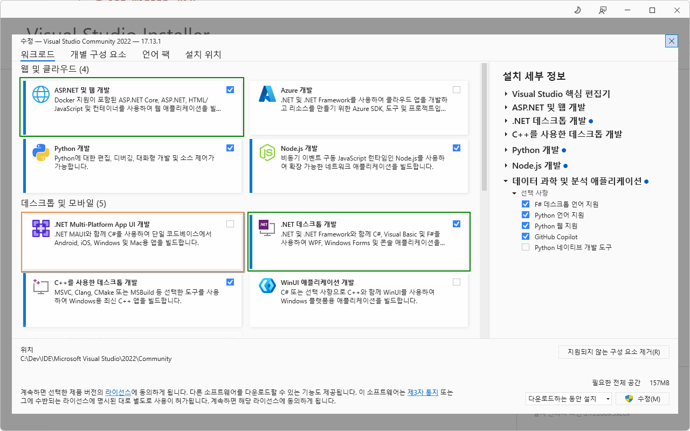

# IoT_CSharp_WinApp_2025
C#/WinApp 리포지토리

## 1일차

### C# 시작 전
- **Visual Studio Installer 확인**

    - **필수** - `ASP.NET 및 웹 개발`, `.NET 데스크톱 개발`
    - **옵션** - .NET Multi-Platform App Ui(MAUI) 개발

    

### C# 학습

#### C#이란?
- **C#** : **마이크로소프트**가 개발한 객체지향 프로그래밍 언어
    - 1991년 귀도 반 로섬 Python 개발(1989년 개발 시작)
    - 1985년, 비야네 스트롭스트룹 C++ 개발(너무 어려움, 1980년 초 개발 시작)
    - 1995년, 제임스 고슬링 Java 개발(C++ 문법 기반, 좀 더 쉬운 언어, 1991년 개발 시작)
    - Java 인기 폭발
    - MS가 썬 마이크로시스템즈와 라이센스 채결 후 MS용 Java인 J++ 개발. 특허권 소송 발생
    - 1999년, 파스칼과 델파이 개발한 `앤더스 헤일스버그`가 C++, Java 기반으로 C# 개발
    - 2000년, C# 발표
    - 2025년, C# 13.0

- **C# 특징**
    - 닷넷 플랫폼 위에서 동작(Managed C++, C#, Java, Python, ...)
    - 문법이 Java와 상당히 유사. C/C++보다 언어 난이도 낮음
    - Java와 달리 Unsafe mode 사용하면 C/C++ 포인터 기능 사용 가능
    - 런타임 시 `Garbage Collection`으로 자동으로 메모리 관리

- **C# 유머**
    - 1999년 앤더스 헤일스버그가 처음에 Cool(C-like Object Oriented Language)로 이름 지음
    - C# 의미 - C++보다 개선된 언어의 의미로 C++++, 또는 #(반올림)

- **C# 버전**
    - C# 1.x - 2002 ~ 2003년 / .NET Framework 1.x -> 문제 많음
    - C# 2.x - 2006년. / .NET Framework 2.x -> 개선 많이 됨
    - C# 3.x - 2007년. / .NET Framework 2.x ~ 3.5 -> Java와 차이 많아짐
    - C# 4.x - 2010년. / .NET Framework 4.x -> C#의 기반
    .
    .
    - C# 6.x - 2015년 / .NET Framework 4.6, .NET Core 1.x(리눅스)
    - C# 7.x - 2017 ~ 2018년 / .NET Framework 4.7, .NET Core 2.x(리눅스)
    .
    .
    - C# 9.0 - 2020년 / `.NET 5.0`(Framework, Core 통합)
    - C# 10.0 - 2021년 / .NET 6(소수점 삭제)
    - C# 11.0 - 2022년 / .NET 7
    - C# 12.x - 2023년 / .NET 8
    - C# 13.x - 2024 ~ 2025년 / .NET 9 (Visual Studio 2022에서 동작)

- **호환성, 범용성**
    - 초기 - Java는 OS 플랫폼에 독립적인 반면, C#은 Windows OS에서만 동작. 범용성 낮았음
    - 2016년 - Linux 공식 지원. MacOS에서도 사용 가능. 오픈소스 공표
    - 유니티 엔진 기본언어, Xamarin(이후 MAUI로 변경)로 모바일 개발 가능
    - 리눅스 닷넷 개발 프로젝트 Mono -> 이후 MS에 흡수

#### .NET Framework(.NET)
- `CLR(Common Language Runtime)` 클래스 사용하는 가상 머신. 예로 C#과 Java로 동시 개발 가능
- Java의 JVM과 유사한 개념
- 언어가 발전하면서 필요한 기능이 늘기 때문에 .NET Framework도 버전업 계속함
- 2015년 리눅스 지원 개발부터 .NET Framework가 너무 Windows 구조에 토착되다보니 새로운 프레인워크가 필요해짐
- .NET Core - 리눅스 지원용으로 만든 .NET [Framework]
- .NET Core와 .NET Framework 혼용
- 2020년 .NET Core와 .NET Framework 통합 -> .NET 5.0 공표. 이후부터 Framework, Core라는 이름 사라짐
- C# 버전, .NET 버전 숫자 차이나기 시작

- .NET 데스크톱 개발 설치하면 C#, Visual Basic, F# 등 여러 언어 사용 가능

- `C# 12.0` / `.NET 8`, `Visual Studio 2022` Community Edition에서 학습
***
## 2일차
- WinApp으로 문법 학습 - 문법 학습 후 WPF로 이전

### 윈앱 컨트롤 - tabindex
- `Button` : 마우스 클릭을 위한 컨트롤
    - 보통 Btn~으로 시작
    - `(Name)` : 소스코드 상에서 접근, 사용
    - Enabled : 사용여부
    - Location : 폼 상의 위치(x, y)
    - Size : 버튼 크기(w, h)
    - TabIndex : 실행 후 탭으로 포커스가 가는 순서
    - Text : 버튼 표시 글씨
    - Visible : 화면 표현여부
    - **Click** : 버튼 클릭 이벤트 처리 메서드 연결

- `Label` : 화면 상의 글자만 표현하는 컨트롤
    - 보통 Lbl~로 시작
    - Button 컨트롤과 동일
    - 이벤트를 거의 사용하지 않음

- `TextBox` : 텍스트 입력을 위한 컨트롤
    - 보통 Txt~로 시작
    - Button 컨트롤과 동일
    - MaxLength : 최대 몇 자까지 적을 수 있는지
    - Multiline : 여러 줄 사용 여부. true가 되어야 높이 조절 가능
    - PlaceholderText : 입력 전 입력 내용 표시
    - **TextChanged** : 글자가 변경되면 발생하는 이벤트
    - **KeyPress** : 키보드 입력이 생기면 발생하는 이벤트

- `ComboBox` : 여러 개 중 아이템을 선택하는 컨트롤
    - 보통 Cbo~ 로 시작
    - Button 컨트롤과 속성은 동일
    - Items(Collection) : 필요한 아이템 할당
    - **SelectedIndexChanged** : 선택한 아이템 순번이 바뀔 때 발생하는 이벤트
    - **SelectedValueChanged** : 선택한 아이템 값이 바뀔 때 발생하는 이벤트

- `RadioButton` : 여러 개 중 하나만 선택하는 컨트롤
    - 보통 Rdo~ 로 시작
    - Button 컨트롤과 속성은 동일
    - Checked : 체크 여부
    - 보통 이벤트 사용하지 않음

### C# 문법
- 기본 문법 - C++, Java와 거의 동일. C++와의 차이점만 비교
    1. 기본 구조 및 주석 - [소스](./day02/Day02Study/SyntaxWinApp01/FrmMain.cs)
        - 네임스페이스, 클래스, 메서드

        ```cs
        namespace ConsoleApp2
        {
            /// <summary>
            /// 프로그램 클래스
            /// </summary>
            internal class Program
            {
                static void Main(string[] args)
                {
                    /// <summary>
                    /// 주석 - XML 주석. 소스코드 자동 문서 생성 시 사용
                    /// </summary>
                    /// <param name="args">입력파라미터</param>
                    // 주석 - 한 줄 주석
                    Console.WriteLine("Hello, World!");
                    /*
                    * 주석 - 여러 줄 주석
                    * 여러 줄 작성할 때 편리
                    */
                }
            }
        }
        ```
    2. 자료형과 변수, Nullable
        - 변수 사용은 C++과 동일
        - 자료형도 C++과 유사하지만, 닷넷타입은 차이 존재
        - 닷넷타입은 여러 언어에서 공통으로 사용하기 위해 추가된 기능
        - Nullable : 특수타입. 데이터 타입 뒤에 ? 추가. null 할당 가능
        - var타입 : 지역변수에서 타입을 동적으로 지정. 컴파일 시 해당 타입으로 자동 지정
            - 지역변수만 가능(전역변수 사용불가)
            - 한 번 타입이 지정되면 다른 타입으로 변경 불가

    3. 연산자
        - C, C++과 동일

    4. 분기문, 반복문
        - if 문
        - switch 문
        - for 문
        - while 문

### 새 프로젝트(콘솔) 만들기
- 순서
    1. 새 프로젝트 만들기
        - 언어 : C#
        - 플랫폼 : 모든 플랫폼
        - 프로젝트 : 콘솔 선택(데스크톱, 웹, 콘솔 중中)
    2. 새 프로젝트 구성
        - 프로젝트 이름, 위치, 솔루션 이름
        - 솔루션 및 프로젝트를 같은 디렉토리에 배치 체크박스 해제 : 솔루션 내에 여러 프로젝트를 관리
    3. 추가 정보
        - 프레임워크 : .NET 8.0(장기 지원) 선택
        - 최상위 문 사용 안함 체크
    4. 스케폴딩 후 IDE 오픈

### 새 프로젝트(데스크톱, 윈앱) 만들기
- 아직 멀티플랫폼은 지원 안 됨(Windows만 지원)
- Windows Forms : 가장 오래된 윈앱 개발
- WPF : 디자인적으로 뛰어난 윈앱 개발
- 순서
    1. 언어, 플랫폼, 프로젝트 선택
        - 언어 : C#
        - 플랫폼 : 모든 플랫폼
        - 프로젝트 : 데스크톱 선택
    2. Windows Forms 앱 선택(.NET Framework가 안 적힌 것)
    3. 프로젝트명 입력
    4. 추가 정보
        - 프레임워크 : .NET 8.0 선택
        - LTS(Long Term Support) : 개발자가 기능, 보안 업데이트를 지원

- 프로젝트 구조
    - 종속성 : 필요 모듈 추가, 관리, 삭제
    - Form1.cs : 윈폼 앱 개발 로직
        - Form1.Designer.cs : 실제 디자인 소스
        - Form1.resx : 아이콘, 이미지, 리소스 문자열 관리 파일
    - Program.cs : 시작 프로그램 소스. 지우면 안 됨

### 솔루션 관리
- 하나의 솔루션에 여러 개 프로젝트가 있으면 시작 프로젝트가 선별되어야 함
- 굵은 글씨체로 나오는 프로젝트가 시작 프로젝트
    1. 시작 프로젝트로 변경할 프로젝트 > 마우스 오른쪽 버튼 > 시작 프로젝트로 설정
    2. 전체 솔루션 > 속성 > 속성 페이지
        - 시작 프로젝트 구성 메뉴 > 현재 선택 영역 선택

- 전체 솔루션 : *.sln(전체 솔루션 관리)
    - 프로젝트 파일(C#) : *.csproj
    - 프로젝트 파일(C++) : *.vcxproj

- debug/release 모드
    - debug : 개발 시 사용 모드. 디버깅 로그, 디버깅 위주
    - release : 배포 시 사용 모드. 프로그램 최적화, 성능 up

### 윈폼 앱 / 윈앱 개발 순서
1. Form1.cs 이름 변경 : FrmMain.cs
    - 변경 시 `모든 참조 이름도 바꾸시겠습니까?` 메시지 창
        - 반드시 `예` 선택

2. FrmMain.cs [디자인] 클릭 오픈
    - 마우스로 크기 조정

3. 속성 창(F4) 오픈, 솔루션 탐색기 아래쪽 드래그 후 붙이기

4. PyQt Designer와 거의 유사
    - FrmMain 속성 창 > Text > Form1 글자를 변경 후 엔터
    - Size 속성 > Width, Height를 직접 수정
    - StartPosition > CenterScreen으로 변경
    - MaximizeBox > False
    - FormBorderStyle > Sizable -> FixedSingle로 변경

5. 보기 > 도구 상자 클릭
    - 공용 컨트롤 > Button 드래그
    - 더블클릭, 클릭으로 선택 후 폼에서 왼쪽 버튼 누르고 드래그 등 다양함

6. 속성 창 - 드롭다운 컨트롤 클릭 > 여러 클래스 리스트

7. button1 속성 변경
    - (Name) > button1 -> BtnMsg 로 변경
    - Size 조정
    - Text > button1 -> 메시지 로 변경

8. 속성 창의 이벤트아이콘(번개 표시) 클릭
    - Click 선택 되어 있음
    - 버튼의 경우, 버튼 클릭이 기본 이벤트
    - Click 오른쪽 빈공간을 더블클릭
    - 버튼을 클릭했을 시 처리할 이벤트 메서드가 자동 생성

9. 새로 만든 컨트롤을 더블클릭
    - 이벤트 메서드가 자동 생성
    - 최초에 아무런 이벤트가 없을 때 기본 이벤트 메서드 생성

10. 오류 발생 시
    - 폼 디자인의 컨트롤 이벤트와 로직 코드 상의 이벤트 처리 메서드 생성 불일치로 발생
    - 이벤트 이름은 생성되고, 이벤트 정의 메서드는 생성이 안 된 상황

    

    - FrmMain.Designer.cs 파일 오픈 
    - Windows Form Designer generated code 탭 확장
    - 오류난 이벤트 이름 삭제
        - BtnMsg.Click += ...
        - BtnOK.Click += ...

11. MesasgeBox.Show() 작업
    - MessageBoxIcon.Warning, MesasgeBoxIcon.Error 사용 시 알람 사운드 발생

12. 폼 디자이너 화면과 코드 상 전환
    - F7(소스 코드 보기)
    - Shift + F7(디자인 전환)

13. VS에서 더블클릭 함부로 하지 말 것
    - 이벤트 메서드 생성, 컨트롤 자동 생성, 폼 디자인 표시 등에서만 사용

14. 두 개 이상의 컨트롤 선택 후 Ctrl키 누른 상태에서 드래그하면 그룹으로 복사
***
## 3일차
- 기본 문법
    1. 문자열 처리
    2. 문자열 처리, 메서드
    3. 클래스와 객체
    4. 접근제어자
    5. 상속, 다형성, 추상클래스, 인터페이스
    6. 예외철
    7. 컬렉션
    8. 파일 입출력
    9. 델리게이트, 이벤트
    10. 람다식
    11. LINQ
    12. 비동기
    13. 속성
    14. 제네릭


## 10일차

### 코테